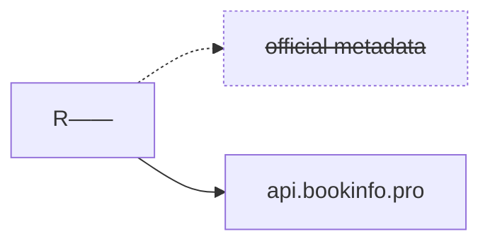

> [!IMPORTANT]
> The original R—— project has been retired, but there are community forks
> available which continue to work by using rreading-glasses metadata:
>   * [pennydreadful/bookshelf](https://github.com/pennydreadful/bookshelf/pkgs/container/bookshelf) (G——R——, Hardcover)
>   * [Faustvii/Readarr](https://github.com/Faustvii/Readarr/pkgs/container/readarr) (G——R——)
>
> If you're a developer interested in helping I encourage you to contribute
> towards those forks (or start your own!). I do not endorse the vibe-coded
> Chaptarr project. A comparison of forks is available
> [here](./FORKS.md).

# 🤓 rreading-glasses [](https://discord.gg/Xykjv87yYs)

Corrective lenses for curmudgeonly readars in your life.

tl;dr: [follow these instructions](#usage).

This is a drop-in replacement for R——'s (now defunct) metadata service. It
works with your existing R—— installation, it's backwards-compatible with your
library, and it takes only seconds to enable or disable. You can use it
permanently, or temporarily to help you add books the R—— service doesn't have
yet. It works equally well with ebooks and audiobooks.

Unlike R——'s proprietary service, this is much faster, handles large authors,
has full coverage of G——R—— (or Hardcover!), and doesn't take months to load
new books. Hosted instances are available at `https://api.bookinfo.pro`
(G——R——) and `https://hardcover.bookinfo.pro`, but it can also be self-hosted.



As of January 2026 there are ~12k daily users of the shared instance.

## Usage

The easiest way to use this metadata is via a community fork of R—— which has
already been configured to use a shared instance:
* [pennydreadful/bookshelf](https://github.com/pennydreadful/bookshelf/pkgs/container/bookshelf) (G——R——, Hardcover)
* [Faustvii/Readarr](https://github.com/Faustvii/Readarr/pkgs/container/readarr) (G——R——)

See the table below for important differences between the two options for metadata.

|                        | G——R——                                                                                                                                                                   | Hardcover                                                                                                                                                                                                                                                   | "Official" metadata                                                                     |
| --                     | --                                                                                                                                                                       | -------------                                                                                                                                                                                                                                               | --                                                                                      |
| Summary                | Lower quality but backward-compatible with existing R—— installations. Makes all of G——R—— available, including large authors and books not previously available in R——. | Higher quality metadata but not backward compatible. **Requires a fresh installation.**                                                                                                                                                                     | Didn't support some of the most popular authors and was always half a year out of date. |
| New releases?          | Supported                                                                                                                                                                | Supported                                                                                                                                                                                                                                                   | Unsupported                                                                             |
| Large authors?         | Supported                                                                                                                                                                | Supported                                                                                                                                                                                                                                                   | Unsupported                                                                             |
| Curation?              | Metadata isn't really editable by users.                                                                                                                                 | An active community of [librarians](https://hardcover.app/blog/librarian) curate metadata as it appears on the Hardcover website (they're unaffiliated with this project). You can request changes in [#book-data-requests](https://discord.gg/YNRtx7EXHX). | N/A                                                                                     |
| Source code            | Public                                                                                                                                                                   | Public                                                                                                                                                                                                                                                      | Private                                                                                 |
| Stability              | Stable, nearly identical behavior to "official" R—— metadata.                                                                                                            | Beta, still loading data.                                                                                                                                                                                                                                   | Unmaintained                                                                            |
| Backward compatibility | Fully compatible with existing R—— databases and Docker images.                                                                                                          | Requires a custom R—— Docker image and fresh database.                                                                                                                                                                                                      | N/A                                                                                     |
| Hosted instance        | `https://api.bookinfo.pro`                                                                                                                                               | `https://hardcover.bookinfo.pro`                                                                                                                                                                                                                            | N/A                                                                                     |
| Self-hosted image      | `blampe/rreading-glasses:latest`                                                                                                                                         | `blampe/rreading-glasses:hardcover`                                                                                                                                                                                                                         | N/A                                                                                     |

Please consider [supporting](https://hardcover.app/supporter) Hardcover if you
use them as your source. It's $5/month (or $50/year) and the work they are doing to break
down the G——R—— monopoly is commendable.

If you're self-hosting or still using legacy R—— images, navigate to
`http(s)://<your instance>/settings/development`. This page isn't shown in the
UI, so you'll need to manually enter the URL.

Update `Metadata Provider Source` with `https://api.bookinfo.pro` if you'd like
to use the public instance. If you're self-hosting use your own address.

Click `Save`.


You can now search and add authors or works not available on the official
service.

> [!IMPORTANT]
> Metadata is periodically refreshed and in some cases existing files may
> become unmapped (see note above about subtitles). You can correct this from
> `Library > Unmapped Files`, or do a `Manual Import` from an author's page.

### Before / After


## Self-hosting

Images are available at
[`blampe/rreading-glasses`](https://hub.docker.com/r/blampe/rreading-glasses).
The `latest` tag uses G——R—— for metadata and the `hardcover` tag uses
[Hardcover](https://hardcover.app). See the table below for a summary of the
differences between the two.

A Postgres backend (any version) is required.

Two docker compose example files are included as a reference:
`docker-compose-gr.yml` and `docker-compose-hardcover.yml`.

The app will use as much memory as it has available for in-memory caching, so
it's recommended to run the container with a `--memory` limit or similar.

### Hardcover Auth

When using Hardcover you must set the `hardcover-auth` parameter.

* Create an account or login to [Hardcover](https://hardcover.app).
* Click on User Icon and Settings.
* Select `Hardcover API`.
* Copy the entire token **including** `Bearer`.
* Pass this to the app via `--hardcover-auth="Bearer <your token>"`.

Note that your API key **will expire every year on January 1**, so you'll need
to periodically regenerate it.

### Hardcover bibliography diagnostics

The `hardcover-king-diagnostics.1` image is a private GHCR diagnostic build for
investigating a single author refresh. It does not alter Hardcover queries,
candidate selection, cache keys, or returned metadata. Set
`HARDCOVER_DIAGNOSTIC_AUTHOR_IDS` to a comma-separated list of numeric Hardcover
author IDs; only those authors emit `hardcover_bibliography` structured records.

The workflow **publish Hardcover diagnostics** builds the `rghc` binary and
publishes `ghcr.io/jmsloat/rreading-glasses:<tag>`. Record the workflow's
resulting manifest digest and the fork commit in the deployment runbook, set
package visibility to private, and deploy only the digest reference. Operators
must authenticate to GHCR before pulling the private package. Each configured
author refresh emits one `refreshID`-correlated summary with stage and terminal
outcome counts; do not log or share the Hardcover authorization value.

### Resource Requirements

Resource requirements are minimal; a Raspberry Pi should suffice. Storage
requirements will vary depending on the size of your library, but in most cases
shouldn't exceed a few gigabytes for personal use. (The published image doesn't
require any large data dumps and will gradually grow your database as it's
queried over time.)

### Troubleshooting

When in doubt, make sure you have the latest image pulled: `docker pull
blampe/rreading-glasses:latest` or `blampe/rreading-glasses:hardcover`.

If you suspect data inconsistencies, request an [author
refresh](https://github.com/blampe/rreading-glasses/issues/new?template=refresh.yml)
and wait a little while. Note that R—— caches metadata locally for ~30 minutes
in `cache.db` and this file is safe to remove if you want to force the app to
grab the latest metadata (just restart after you delete the db).

You can also try deleting the rreading-glasses database to ensure you don't
have any bad data cached. (If this does resolve your problem please let me know
because that's a bug.)

If these steps don't resolve the problem, please create an issue!

## Key differences

I have deviated slightly from the official service's behavior to make a couple
of, in my opinion, quality of life improvements.

- The first time an author is encountered their books will be incomplete while
  their data is loaded in the background. This is what allows large authors and
  more real-time data ingestion to work. You can still add books for an author
  while their data is being loaded, you just need to search for them manually.
  If you see an author that looks incomplete, wait a little bit or [request a
  refresh](https://github.com/blampe/rreading-glasses/issues/new?template=refresh.yml).

- Titles no longer automatically include subtitles _unless_ it's part of a
  series, or if multiple books have the same primary title. This de-clutters
  the UI, cleans up the directory layout, and improves import matching but
  __you may need to re-import some works with long subtitles__.

- The "best" (original) edition is always preferred to make cover art more
  consistently high-quality. Additionally, books are no longer returned with
  every edition ever released, because that makes manual edition selection
  difficult to impossible. Instead, at most 20 of the top editions are included
  and de-duplicated by language and title. This may change in the future.

## Details

This project implements an API-compatible, coalescing read-through cache for
consumption by the R—— metadata client. It is not a fork of any prior work and
it was made without any help from the S—— team.

The service is pluggable and can serve metadata from any number of sources: API
clients, data dumps, OpenLibrary proxies, scrapers, or other means. The
interface to implement is:

```go
type Getter interface {
    GetWork(ctx context.Context, workID int64) (*WorkResource, error)
    GetAuthor(ctx context.Context, authorID int64) (*AuthorResource, error)
    GetBook(ctx context.Context, bookID int64) (*WorkResource, error)
}
```

In other words, anything that understands how to map a G——R—— ID to a Resource
can serve as a source of truth. This project then provides caching and API
routes to make that source compatible with R——.


Postgres is used as a backend but only as a key-value store, unlike the
official server which performs expensive joins in the request path.
Additionally large authors (and books with many editions) are populated
asynchronously. This allows the server to support arbitrarily large resources
without issue.

## Contributing

This is primarily a personal project that fixes my own workflows. There are
almost certainly edge cases I haven't accounted for, so contributions are very
welcome!

### TODO

- [ ] (QOL) Ignore works/editions without publisher to cut down on
      self-published ebook slop.
- [ ] (QOL) Update R—— client to send `Accept-Encoding: gzip` headers.

## Disclaimer

This software is provided "as is", without warranty of any kind, express or
implied, including but not limited to the warranties of merchantability,
fitness for a particular purpose and noninfringement.

In no event shall the authors or copyright holders be liable for any claim,
damages or other liability, whether in an action of contract, tort or
otherwise, arising from, out of or in connection with the software or the use
or other dealings in the software.

This software is intended for educational and informational purposes only. It
is not intended to, and does not, constitute legal, financial, or professional
advice of any kind. The user of this software assumes all responsibility for
its use or misuse.

The user is free to use, modify, and distribute the software for any purpose,
subject to the above disclaimers and conditions.
